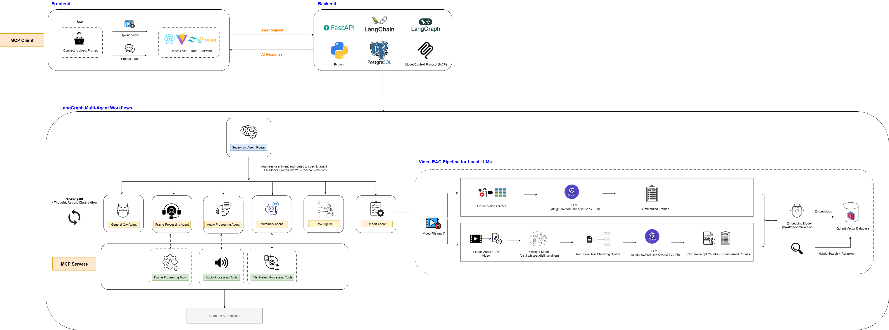
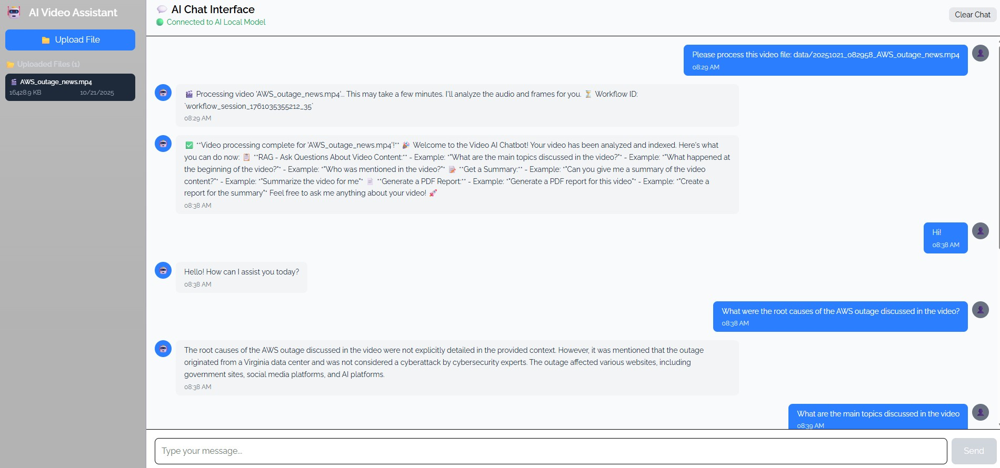
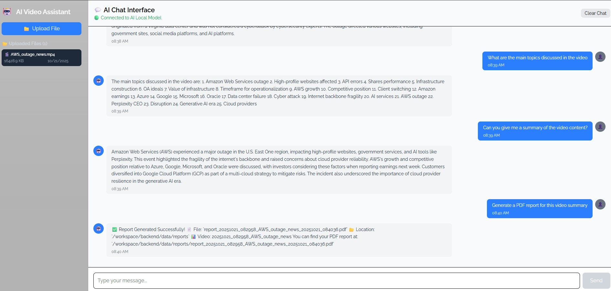

# 🤖 End-to-End Full Stack Video RAG Understanding with Local Agentic SLM

An AI-powered video analysis system using multi-agent architecture with local small language models (SLMs) for video Q&A through Retrieval-Augmented Generation (RAG) and MCP tools integration.


## Table of Contents

- [Overview](#overview)
- [Key Features](#key-features)
- [Architecture](#architecture)
- [Prerequisites](#prerequisites)
- [Getting Started](#getting-started)
- [Project Structure](#project-structure)
- [Contributing](#contributing)
- [Contact](#contact)

---

## Overview

This project implements an end-to-end **Video RAG (Retrieval-Augmented Generation)** full stack application system that enables users to:
- 🎞️ Upload and process video files
- 🎧 Extract and transcribe audio content
- 🖼️ Analyze video frames with vision-language models
- 💬 Ask questions about video content using natural language
- 📄 Generate comprehensive PDF reports with insights
- 🔍 Perform semantic search across video content using hybrid retrieval (BM25 + dense vectors)

---

## Key Features

### Video Processing
- 🎥 Multi-format video upload support
- 🖼️ Automatic frame extraction at configurable intervals
- 🔊 Audio extraction and transcription using Whisper
- 👁️ Frame analysis with vision-language models

### AI Capabilities
- 🤖 Multi-agent architecture with intelligent routing
- 🔍 Hybrid search (BM25 + dense vector search)
- 💬 Context-aware Q&A using RAG
- 📝 Automatic video summarization
- 📄 PDF report generation

### Tech Stack
- ⚛️ Frontend: React + Vite + Tauri (optional desktop app)
- ⚡ Backend: FastAPI + LangChain + LangGraph
- 🗄️ Database: PostgreSQL + Qdrant Vector Database
- 🤗 AI Models: Local Hugging Face models (SLMs)
- 🔌 Tools: MCP integration for extensible capabilities

---

## Architecture

The architecture below demonstrates an end-to-end full-stack agentic local SLM multi-agent application for analyzing and querying video content, from frontend to backend with their respective specialized agents.




### Application Interface




---

## Prerequisites

### Software Requirements

| Software | Version | Purpose |
|----------|---------|---------|
| Python | 3.11 | Backend runtime |
| Node.js | 18+ | Frontend development |
| PostgreSQL | 15+ | Database |
| Qdrant | Latest | Vector database |

### Hardware Requirements (for local models)

- **GPU:** NVIDIA GPU with CUDA support (Compute Capability ≥ 7.0)
- **VRAM:** 8 GB minimum, 16 GB+ recommended
- **RAM:** 8 GB minimum, 16 GB recommended
- **Storage:** 10 GB+ free space for models
- **Driver:** NVIDIA Driver ≥ 530 and CUDA ≥ 12.0

**Note: I tested this setup on [RunPod](https://www.runpod.io/) VM with RTX 4090*

---

## Getting Started

### 1. Clone Repository

```bash
git clone https://github.com/JennyTan5522/End-to-End-Video-RAG-Understanding-with-Local-Agentic-SLM.git
```

___

### 2. Backend Setup

Refer to the 📄 [backend README](backend/README.md) for detailed installation instructions:
- Install Python dependencies
- Set up PostgreSQL database
- Configure Qdrant vector database
- Download required AI models

**Step 1: Start Audio processing MCP server (Teriminal 1)**
```bash
cd backend
source env/bin/activate  # or env\Scripts\activate (Windows)
python -m web.mcp_tools.audio_extractor
```

**Step 2: Start Video processing MCP server (Teriminal 2)**
```bash
cd backend
source env/bin/activate  # or env\Scripts\activate (Windows)
python -m web.mcp_tools.video_frames_extractor
```

**Step 3: Start FastAPI backend (Teriminal 3)**
```bash
cd backend
python -m venv env
source env/bin/activate  # or env\Scripts\activate (Windows)
python -m web.app
```

**Services will be running on:**
- FastAPI Backend: `http://localhost:8000`
- Audio MCP Server: `http://localhost:8002`
- Video MCP Server: `http://localhost:8003`
- 
⚠️ *Note: The FastAPI backend startup may take several minutes as the backend needs to load local models (chat model, embedding model, vision-language model) into memory.*

___

### 3. Frontend Setup

Refer to the 📄 [frontend README](frontend/README.md) for detailed installation instructions:
- Install npm dependencies
- Configure environment variables
- Start development server

```bash
cd frontend
npm run dev
```

Frontend runs on: `http://localhost:5173`

### 4. (Optional) Desktop Application

```bash
npm run dev # or npm run dev -- --host 0.0.0.0 --port 5173 --strictPort to access from any device on your network at http://<your-ip>:5173
```

---

## Project Structure

```
your_project_root_folder/
├── backend/                      # FastAPI backend - AI logic, multi-agent system, and API
│   └── README.md                 # Backend documentation
│
├── frontend/                     # React frontend - UI for chat, video upload, and processing
│   └── README.md                 # Frontend documentation
│
├── sample_videos/                # Sample mp4 video for experiment
│
└── README.md                    
```

**For detailed structure of each component:**
- 🐍 Backend: [`backend/README.md`](backend/README.md)
- ⚛️ Frontend: [`frontend/README.md`](frontend/README.md)

---

## Contributing

Contributions are welcome! If you find any issues or have suggestions for improvements:

1. **Fork** the repository
2. **Create** a new branch (`git checkout -b feature/improvement`)
3. **Commit** your changes (`git commit -m 'Add new feature'`)
4. **Push** to the branch (`git push origin feature/improvement`)
5. **Open** a Pull Request

**Found a bug?** Please create an issue with:
- Description of the problem
- Steps to reproduce
- Expected vs actual behavior
- Screenshots (if applicable)

Thank you for helping improve this project! 🙏

---

## Contact

- 💻 GitHub: [@JennyTan5522](https://github.com/JennyTan5522)
- 📧 Email: jennytan5522@gmail.com

Feel free to reach out for questions, suggestions, or collaboration opportunities!
*Note: This project is for educational and research purposes.*

---

⚡ **Built with Vite + React + Tauri**  
🚀 **Backend powered by FastAPI + PostgreSQL + Qdrant + Local SLM Multi-agent + MCP**